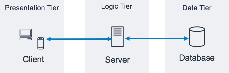

# 🏗️ 3-Tier Architecture

## 📌 개요

**3-Tier Architecture 3계층 구조**는 애플리케이션을  
**① 프레젠테이션 계층 (Presentation Tier)**,  
**② 비즈니스 로직 계층 (Application/Logic Tier)**,  
**③ 데이터 계층 (Data Tier)**  
세 단계로 나누어 설계하는 소프트웨어 아키텍처 패턴입니다.

이 방식은 **유지보수성**과 **확장성**을 높이고, 각 계층의 역할을 분리하여 **코드 재사용성**을 향상시킵니다.

---

## 🏗️ 구조

### 🎨 Presentation Tier (프레젠테이션 계층)
- **설명:** 사용자가 직접 보는 화면(UI) 또는 클라이언트 애플리케이션  
- **예:** 웹 브라우저, 모바일 앱, 프론트엔드

### ⚙️ Application / Logic Tier (비즈니스 로직 계층)
- **설명:** 애플리케이션의 핵심 로직, 데이터 처리, API
- **예:** Spring Boot, Node.js 서버, Django

### 💾 Data Tier (데이터 계층)
- **설명:** 데이터를 저장하고 관리하는 계층
- **예:** MySQL, PostgreSQL, MongoDB

---

## 🖼️ 구조 다이어그램

  

> 🔎 위 그림은 **3계층이 독립적으로 동작**하면서 **요청(Request) → 응답(Response)** 흐름으로 연결되는 것을 보여줍니다.

---

## ✅ 장점
- 🔧 **유지보수 용이** (계층별 수정이 독립적)
- 📈 **확장성 향상** (스케일 아웃/인 가능)
- 🔐 **보안 강화** (데이터 계층 분리)

## ⚠️ 단점
- 🏗️ 초기 설계가 조금 복잡
- 📉 계층 간 통신으로 인한 성능 오버헤드
