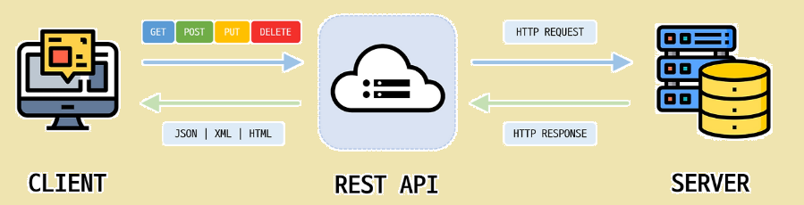

# CRUD 개념과 웹 흐름 (Create, Read, Update, Delete)

웹 애플리케이션의 90%는 CRUD로 요약할 수 있습니다.
회원가입, 로그인, 게시판, 쇼핑몰, SNS… 모두 데이터를 **생성(Create)**, **조회(Read)**, **수정(Update)**, **삭제(Delete)** 하는 행위의 반복입니다.  
따라서 CRUD를 제대로 이해하는 것은 곧 웹 서비스의 본질을 이해하는 것과 같습니다.  

---

## 1. CRUD란 무엇인가?

CRUD는 **데이터를 다루는 4가지 기본 기능**입니다.

- **Create (생성)** → 새로운 데이터를 추가  
- **Read (조회)** → 저장된 데이터를 가져오기  
- **Update (수정)** → 기존 데이터를 변경  
- **Delete (삭제)** → 데이터 제거  

➡️ CRUD는 단순한 개념 같지만, 모든 비즈니스 로직의 출발점입니다.  
예를 들어 SNS 게시글 기능도 이렇게 나눌 수 있습니다.  

- `C` 글 작성  
- `R` 피드 보기, 특정 글 상세 조회  
- `U` 글 수정  
- `D` 글 삭제  

---

## 2. CRUD와 HTTP 메서드의 매핑

웹에서 CRUD는 보통 **RESTful API**의 HTTP 메서드와 연결됩니다.

여기서 잠깐 **RESTful API**란?

REST (Representational State Transfer) 는 2000년 로이 필딩(Roy Fielding)의 박사 논문에서 처음 제시된 아키텍처 스타일입니다.

간단히 말하면, 웹의 자원을 정의하고 자원에 대한 주소(URL)와 행위(HTTP Method)를 일관성 있게 설계하는 방식입니다.

### **핵심 철학**

1. 웹(Web)을 원래 의도대로 활용하자.

2. 모든 것은 자원(Resource)이고, 자원은 고유한 URL로 식별된다.

3. 자원에 대한 행위는 HTTP 메서드(GET, POST, PUT, DELETE 등)로 표현한다.

## **REST의 구성 요소**

1. 자원(Resource)

- 웹에서 접근 가능한 모든 것 (예: 유저, 게시글, 상품)

- 자원은 URI (Uniform Resource Identifier) 로 표현

- 예: /users, /posts/1, /products/42

2. 행위(Verb)

- HTTP 메서드로 표현

- GET, POST, PUT, PATCH, DELETE 등

3. 표현(Representation)

- 자원의 상태를 JSON, XML, HTML 등 다양한 형태로 표현

- RESTful API에서는 대부분 JSON 사용

## **RESTful API란?**

REST 원칙을 잘 지켜서 설계된 API를 RESTful API 라고 부릅니다.

즉, 리소스 중심적이고, HTTP 메서드를 의도에 맞게 사용하며, 일관된 URI 설계를 따르는 API입니다.


## CRUD와 RESTful API 매핑

<p align="center">
  
</p>


⚡ **Tip**:  
- `PUT`은 자원을 전체 교체, `PATCH`는 특정 속성만 수정할 때 자주 사용됩니다.  
- `GET`은 서버 상태를 변경하지 않는 **안전(Safe)** 메서드로 분류됩니다.  

---

## 3. 웹 흐름 (Client ↔ Server ↔ DB)

웹 서비스는 일반적으로 **3계층 구조**로 동작합니다.

1. **Client (브라우저/앱)**  
   - 사용자가 요청을 보냅니다.  
   - 예: 회원가입 버튼 클릭 → `POST /users` 요청  

2. **Server (Backend, API)**  
   - 요청을 처리하고 DB에 접근합니다.  
   - 예: 입력값 검증 후 DB에 새 유저 추가  

3. **Database (DB)**  
   - 실제 데이터를 저장합니다.  
   - 예: `INSERT INTO users ...` SQL 실행  

4. **Response (응답)**  
   - 서버는 처리 결과를 다시 클라이언트로 반환합니다.  
   - 예: `201 Created` 응답과 JSON 데이터  

---

## 4. 실제 예시 (게시판 서비스)

### 1. 게시글 작성 (Create)

## Request
```http
POST /posts
Content-Type: application/json

{
  "title": "첫 번째 글",
  "content": "안녕하세요, 첫 글입니다!"
}
```

## Response
```json
{
  "id": 1,
  "title": "첫 번째 글",
  "content": "안녕하세요, 첫 글입니다!",
  "createdAt": "2025-10-02T12:00:00Z"
}
```

### 2. 게시글 조회 (Read)

## Requset
```http
GET /posts/1
Content-Type: application/json
```

## Response
```json
{
  "id": 1,
  "title": "첫 번째 글",
  "content": "안녕하세요, 첫 글입니다!",
  "createdAt": "2025-10-02T12:00:00Z",
  "updatedAt": "2025-10-02T12:00:00Z"
}
```

### 3. 게시글 수정 (Update)

## Request
```http
PUT /posts/1
Content-Type: application/json

{
  "title": "첫 번째 글 (수정)",
  "content": "내용을 수정했습니다!"
}
```

## Response
```json
{
  "id": 1,
  "title": "첫 번째 글 (수정)",
  "content": "내용을 수정했습니다!",
  "createdAt": "2025-10-02T12:00:00Z",
  "updatedAt": "2025-10-02T13:30:00Z"
}
```

### 4. 게시글 삭제 (Delete)

## Request
```http
DELETE /posts/1
```

## Response
```json
{
  "message": "게시글이 삭제되었습니다."
}
```