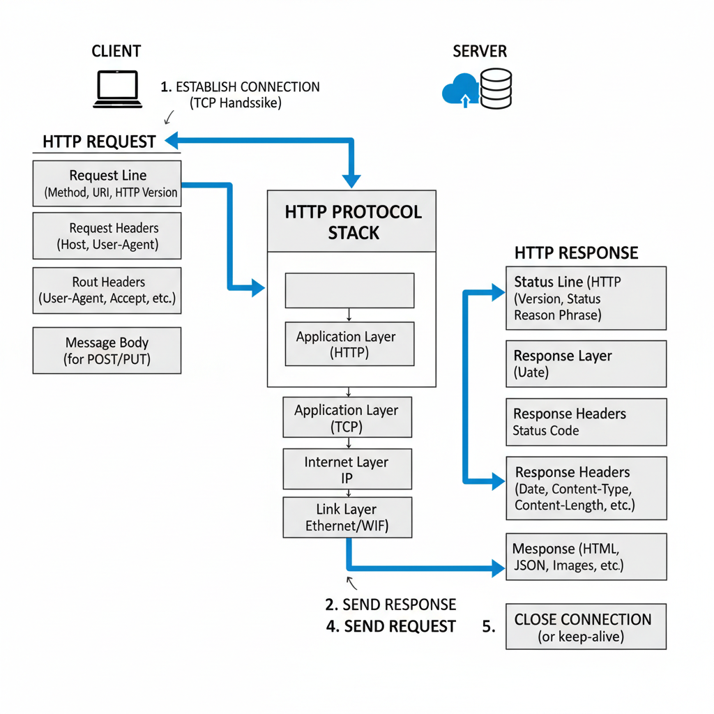

# 🌐 HTTP 통신 구조

## 📌 개요
**HTTP(HyperText Transfer Protocol)**는 클라이언트와 서버가 데이터를 주고받기 위해 사용하는 통신 규약입니다.  
웹 브라우저, 모바일 앱, API 호출 등 대부분의 웹 서비스는 HTTP 통신을 기반으로 동작합니다.

---

## 🔄 HTTP 통신 흐름
HTTP 통신은 크게 **요청(Request)** 과 **응답(Response)** 으로 이루어집니다.

1. **클라이언트**가 서버에 요청(Request)을 보냄  
2. **서버**는 요청을 처리하고 응답(Response)을 생성  
3. 클라이언트는 응답을 받아 화면에 출력하거나 다음 작업을 수행

---

## 🖼️ HTTP 통신 구조 다이어그램
<p align="center">
  
</p>

> 🔎 위 그림은 **클라이언트 → 서버 → 응답** 흐름을 보여줍니다.  
> (GET, POST, PUT, DELETE 등 다양한 HTTP 메서드가 사용될 수 있음)

---

## ✉️ HTTP 메시지 구조

### 📨 Request (요청)
```http
GET /index.html HTTP/1.1
Host: www.example.com
User-Agent: Chrome/120.0
Accept: text/html
```

요청 라인 : GET /index.html HTTP/1.1 (요청 메서드 + 경로 + 프로토콜 버전)
헤더 : Host, User-Agent, Accept 등
바디 : POST/PUT 요청 시 데이터가 포함됨 (예: JSON)

### 📩 Response (응답) 예시

```http
HTTP/1.1 200 OK
Content-Type: text/html
Content-Length: 1234
```
```html
<html>
  <body>Hello World</body>
</html>
```

상태 라인 : HTTP/1.1 200 OK (프로토콜 + 상태코드 + 설명)
헤더 : Content-Type, Content-Length 등
바디 : 서버가 반환하는 실제 데이터 (HTML, JSON, 이미지 등)

 ## ✅ 장점

플랫폼/언어 독립적 (어떤 환경에서도 통신 가능)

단순하고 확장성이 뛰어남

REST API, GraphQL 등 다양한 방식 지원

## ⚠️ 단점

상태 비저장(Stateless) → 매 요청마다 인증 정보 전달 필요

네트워크 지연(latency)에 영향 받음

